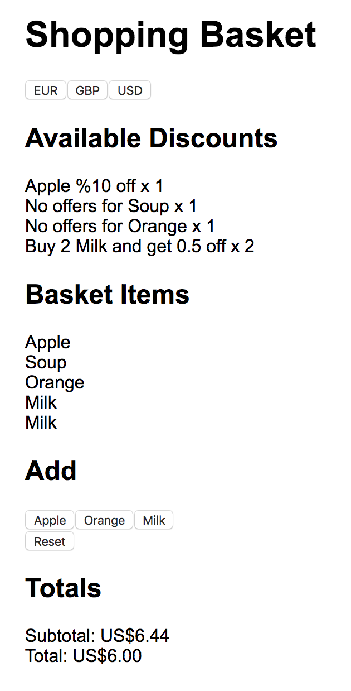

# Basket Service



This is a shopping basket service.

The backend has a Node API service in TypeScript and frontend is a React app in TypeScript that connects to it.

The backend has unit and integration tests setup.

## Installation

The API service requires a free account from [Currency Layer](https://currencylayer.com/).

Create an `.env` file in the `api` directory with:

```sh
CURRENCY_LAYER_ACCESS_KEY=xxxxxxx
```

## Run apps

```sh
npm run setup && npm run start
```

This runs the backend service at `http://localhost:8080` and the frontend at `http://localhost:3000/`.

## Tests

There are both unit and integration tests in `tests` in the `API` which can be run with `npm run test`

Current coverage (integration):

| File      | % Stmts | % Branch | % Funcs | % Lines | Uncovered Line #s |
| --------- | ------- | -------- | ------- | ------- | ----------------- |
| All files | 83.85   | 66.67    | 80.43   | 85.19   |
